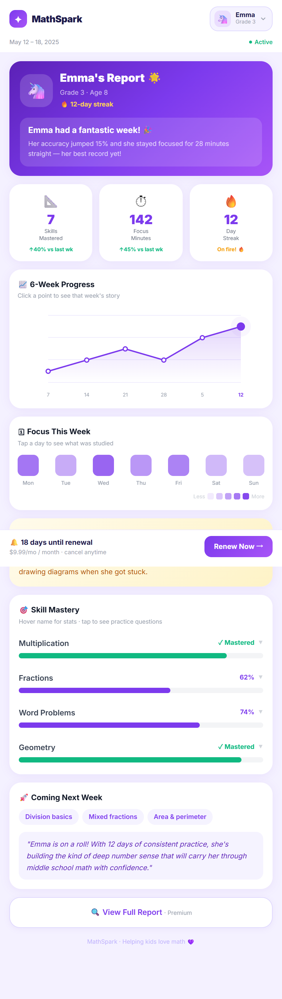

# MathSpark — Parent Weekly Report Demo

A high-fidelity demo of a **parent weekly report** for an overseas children's AI math learning app. Built as a product design exercise: *how do you present a child's math progress in a way that builds parent confidence and drives subscription renewal?*



---

## Features

- **3 child profiles** — Emma (Grade 3), Liam (Grade 5), Sophia (Grade 2), switchable via header dropdown with skeleton loading
- **Staggered entrance animations** — cards fade up sequentially on load; stat counters animate from 0
- **6-week SVG line chart** — hover for tooltip, click a point to reveal that week's story
- **Focus heatmap** — tap any day to slide-expand the skills studied that session
- **Skill progress bars** — hover name for mastery stats; tap to expand recent practice questions
- **Renewal flow** — bottom bar slides in on scroll; full modal with POST `/api/renew`, success toast, and retry on failure
- **Premium upsell** — "View Full Report" hits GET `/api/:id/details`, opens a blurred premium content modal

---

## Quick Start

**Requirements:** Node.js ≥ 16

```bash
# 1. Clone the repo
git clone https://github.com/kiki-GuoWanqi/mathspark-demo.git
cd mathspark-demo

# 2. Install dependencies
npm install

# 3. Start the server
npm start

# 4. Open in browser
# http://localhost:3001
```

No build step, no environment variables. The frontend is a single `index.html` served by Express using React + Babel via CDN.

---

## API Endpoints

| Method | Path | Description |
|--------|------|-------------|
| `GET` | `/api/report/:childId` | Returns full weekly report (emma / liam / sophia) |
| `POST` | `/api/renew` | Simulates subscription renewal (90% success rate) |
| `GET` | `/api/report/:childId/details` | Returns `{ locked: true }` to trigger premium upsell |

All responses include a short artificial delay to simulate real network behavior.

---

## Tech Stack

| Layer | Choice | Reason |
|-------|--------|--------|
| Backend | Node.js + Express 4 | Minimal, no database needed |
| Frontend | React 18 via CDN | No build toolchain — ship in one file |
| Styling | Tailwind CSS via CDN + inline styles | Rapid iteration |
| Charts | Hand-drawn SVG | Zero dependencies; no CDN reliability issues |
| Data | In-memory mock | Demo-only, no persistence needed |

---

## Project Structure

```
mathspark-demo/
├── server.js        # Express server + mock data for 3 children
├── index.html       # Entire React frontend (single file)
├── package.json
└── memory-bank/     # Design docs written during development
    ├── design-document.md
    ├── tech-stack.md
    ├── implementation-plan.md
    └── architecture.md
```

---

## Design Rationale

**Show:** emotional headline, streak, week-over-week growth, 6-week trend, one breakthrough story, next-week preview — everything that builds *confidence and pride*.

**Hide:** raw error logs, peer comparisons, lesson curriculum detail, pricing before value is established — anything that creates anxiety or cognitive overload before the parent is engaged.

The report follows a deliberate arc: **Pride → Confidence → Action (renewal).**
